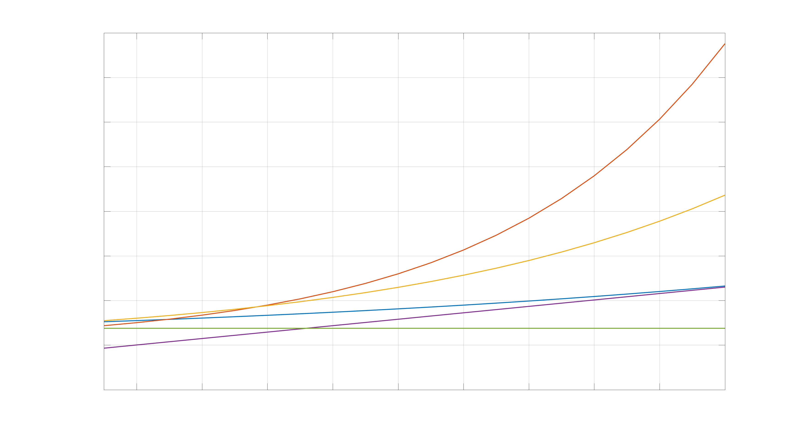

# Introduction to Nonstationary Models in IrisT

$$
\newcommand{\ss}{\mathrm{ss}}
\notag
$$

---

## Key takeaways

* Nonstationary balanced growth path can be preserved in their original
  levels, with no manual stationarizing transformation needed

* A BGP steady state (not a fixed point) can be numerically described

* Valid first-order (or any higher-order local) approximate solution can
  be computed using a Taylor expansion around the BGP

---

## Under what conditions does a balanced-growth path exist?

* Single source of growth

* Multiple sources of growth with no "cross-sectoral" substitution (example: model with real growth and nominal price level growth)

* Multiple sources of growth with "cross-sectoral" substitution provided the elasticities of substitution are unitary (example: model with ttradable/nontradable growth)

---

## What is a BGP steady state needed for?

* Useful analytics on its own, including comparative static simulations

* Numerical description of the steady state needed for first-order (or any
  higher-order) approximate solution

---

## What is a BGP?

Each variables is one of the following:

Kind of variable | Behavior in steady state
---|---
Stationary | Constant at a fixed unique level
Flat | Not changing over time but an unpredetermined level
Constant first difference* | Changing over time with a fixed first difference
Constant rate of change* | Changing over time with a fixed rate of change

[*] If a variable changes over time, we need to know if it shows a constant
first difference or a constant rate of change **before** we start the
steady-state calculations

---

## How to describe the steady state of a nonstationary model?

* Take a snapshot of the variables as they move along their BGP(s) at one
  arbitrary point of time

* Read off two numerical values for each variable:

    1. the level
    2. the first difference or rate of change

* Which snapshot at which particular time we take does not matter

---

## Seeming problems

* How to set up the system of equations to calculate both the levels and
  the differences/rates of change simultaneously?

* How to deal with the non-unique levels (infinitely many solutions), aka a singularity in the system?

* Can we have more control over the levels?

* What do we mean by a local approximation around a nonstationary steady
  state?

---

## Trivial example

$$
\begin{gathered}
A_{t} = \alpha \, A_{t-1} \exp \epsilon_t \\[5pt]
Y_t = \gamma \, A_{t-1}
\end{gathered}
$$

---

## Traditional stationarizing approach: Steady state

1. Define new transformed variables

$$
\begin{gathered}
\hat a_t \equiv A_t / A_{t-1} \\[5pt]
y_t \equiv Y_t / A_t
\end{gathered}
$$

 

2. Rewrite the original equations

$$
\begin{gathered}
A_{t} = \alpha \, A_{t-1} \exp \epsilon_t \quad\longrightarrow\quad
\hat a_t = \alpha \exp \epsilon_t \\[5pt]
y_t = \gamma  A_{t-1} \quad\longrightarrow\quad
y_t = \left. \gamma \middle/ \hat a_t \right. 
\end{gathered}
$$

 

3. Solve for the fixed point in $\hat a$, $y$, this uniquely determines 

   * the steady-state rate of change in $a_t$ and $y_t$

   * the steady-state ratio $y_t/a_t$

 

4. We can create an arbitrary point on the BGP by picking any
   valid value for $A_t$, and calculating the corresponding $Y_t \equiv y_t \, A_t$

---

## Traditional stationarizing approach: First-order approximation

4. Given the fixed point $\hat a_\ss$, $y_\ss$, calculate first-order Taylor expansion and approximate form

$$
\begin{bmatrix}
\hat a_t - \hat a_\ss \\
y_t - y_\ss
\end{bmatrix} 
= T \, 
\begin{bmatrix}
\hat a_{t-1} - \hat a_\ss \\
y_{t-1} - y_\ss
\end{bmatrix} + R \, \epsilon_t
$$

5. In forward-loking models, apply Blanchard-Kahn-Klein procedure using (generalized) eigenvalue
   decomposition to integrate out future expectations

---

## Traditional stationarizing approach: Go the extra mile

5. Note that we can alternatively calculate a log approximation, where the
   log transformations **preserve linearity**

$$
\begin{bmatrix}
\log \hat a_t - \log \hat a_\ss \\
\log y_t - \log y_\ss
\end{bmatrix} 
= T^* \, 
\begin{bmatrix}
\log \hat a_{t-1} - \log \hat a_\ss \\
\log y_{t-1} - \log y_\ss
\end{bmatrix} + R^* \, \epsilon_t
$$

$$
\begin{gathered}
\log \hat a_t \equiv \log A_t - \log A_{t-1} \\[5pt]
\log y_t \equiv \log Y_t - \log A_T
\end{gathered}
$$

 

6. Substitute the definitons of the log transformations back

$$
\begin{bmatrix}
\log A_t - \log A_{t-1} - \log \hat a_\ss \\
\log Y_t - \log A_t - \log y_\ss 
\end{bmatrix} 
= T^* \, 
\begin{bmatrix}
\log A_{t-1} - \log A_{t-2} - \log \hat a_\ss \\
\log Y_{t-1} - \log A_t - \log y_\ss
\end{bmatrix} 
+ R^{*} \, \epsilon_t
$$

 

7. Rearrange to get 

$$
\begin{bmatrix}
\log A_t \\
\log A_{t-1} \\
\log Y_t
\end{bmatrix} 
= T^{**}
\begin{bmatrix}
\log A_{t-1} \\
\log A_{t-2} \\
\log Y_{t-1}
\end{bmatrix} 
+ K^{**} + R^{**} \, \epsilon_t
$$

 

Note that

* an intercept vector $K^{**}$ now appears in the system, based on the fixed-point numbers $\log a_\ss$, $\log y_\ss$

* the transion matrix $T^{**}$ now contains a unit root

* in forward-looking models, the same Blanchard-Kahn-Klein procedure can be
  applied (treating unit roots as **stable* roots)

---

## Direct route

Absolutely no stationarizing step needed to calculate

* a point on the BGP

* a first-order approximate solution

---

## Direct route: Steady-state

1. Write the equations in their steady-state form for the following four unknowns:

   * Level of $A_t$, denoted by $A_\ss$

   * Level of $Y_t$, denoted by $Y_\ss$

   * Rate of change in $A$, denoted by $\hat A_\ss$

   * Rate of change in $Y$, denoted by $\hat Y_\ss$

 

$$
\begin{aligned}
A_{t} = \alpha \, A_{t-1} \exp \epsilon_t
&\quad\longrightarrow\quad
A_\ss = \alpha \, A_\ss / \hat A_\ss
\\[5pt]
Y_t = \gamma \, A_{t-1}
&\quad\longrightarrow\quad
Y_\ss = \gamma \, A_\ss / \hat A_\ss
\end{aligned}
$$

 

2. Problem: 2 equations with 4 unknowns. Apply the following trick: repeat the system at a different time point

$$
\begin{aligned}
A_{t} = \alpha \, A_{t-1} \exp \epsilon_t
&\quad\longrightarrow\quad
A_\ss = \alpha \, A_\ss \, \hat A_\ss^{-1}
\\[5pt]
Y_t = \gamma \, A_{t-1}
&\quad\longrightarrow\quad
Y_\ss = \gamma \, A_\ss \, \hat A_\ss{}^{-1}
\\[15pt]
A_{t+k} = \alpha \, A_{t+k-1} \exp \epsilon_{t+k}
&\quad\longrightarrow\quad
A_\ss \, \hat A_\ss{}^k = \alpha \, A_\ss \, \hat A_\ss{}^{k-1}
\\[5pt]
Y_{t+k} = \gamma \, A_{t+k-1}
&\quad\longrightarrow\quad
Y_\ss \, \hat Y_\ss{}^{k} = \gamma \, A_\ss\, \hat A_\ss{}^{k-1}
\end{aligned}
$$

---

## Direct route: Singularity problem

* The system has infinitely many solutions, the Jacobian is singular 

* We do have algorithms capable of dealing with the singularity, delivering one
   (arbitrary) solution, e.g. Levenberg-Marquardt 

---

## Direct route: First-order approximation

3. Calculate Taylor expansion of each model equation around the BGP 

   * w.r.t. to the **log** of the variables that show a constant rate of change

   * w.r.t. the other variables 

 

$$
f_k \left( A_t, A_{t-1}, Y_{t}, Y_{t-1} \right) = 0
$$

 

$$
\left. \frac{\partial f_k\left( A_t, A_{t-1}, Y_{t}, Y_{t-1} \right)}{\partial \, \log A_t} \middle|_{A_t=A_\ss,\ A_{t-1}=A_\ss \hat A_\ss{}^{-1}, \ Y_t=Y_\ss, \ Y_{t-1}=Y_\ss \hat Y_\ss{}^{-1}} \right.
$$

$$
\left. \frac{\partial f_k\left( A_t, A_{t-1}, Y_{t}, Y_{t-1} \right)}{\partial \, \log A_{t-1}} \middle|_{A_t=A_\ss,\ A_{t-1}=A_\ss \hat A_\ss{}^{-1}, \ Y_t=Y_\ss, \ Y_{t-1}=Y_\ss \hat Y_\ss{}^{-1}} \right.
$$
 
$$
\left. \frac{\partial f_k\left( A_t, A_{t-1}, Y_{t}, Y_{t-1} \right)}{\partial \, \log Y_{t}} \middle|_{A_t=A_\ss,\ A_{t-1}=A_\ss \hat A_\ss{}^{-1}, \ Y_t=Y_\ss, \ Y_{t-1}=Y_\ss \hat Y_\ss{}^{-1}} \right.
$$
 
$$
\left. \frac{\partial f_k\left( A_t, A_{t-1}, Y_{t}, Y_{t-1} \right)}{\partial \, \log Y_{t-1}} \middle|_{A_t=A_\ss,\ A_{t-1}=A_\ss \hat A_\ss{}^{-1}, \ Y_t=Y_\ss, \ Y_{t-1}=Y_\ss \hat Y_\ss{}^{-1}} \right.
$$

$$
\left. \frac{\partial f_k\left( A_t, A_{t-1}, Y_{t}, Y_{t-1} \right)}{\partial \, \epsilon_{t}} \middle|_{A_t=A_\ss,\ A_{t-1}=A_\ss \hat A_\ss{}^{-1}, \ Y_t=Y_\ss, \ Y_{t-1}=Y_\ss \hat Y_\ss{}^{-1}} \right.
$$
 
 
 

4. Set up the dynamic system

$$
\begin{bmatrix}
\log A_t - \log A_\ss \\[5pt]
\log A_{t-1} - \log (A_\ss \hat A_\ss{}^{-1}) \\[5pt]
\log Y_t - \log Y_\ss \\[5pt]
\end{bmatrix}
=
T^{**}
\begin{bmatrix}
\log A_{t-1} - \log (A_\ss\hat A_\ss{}^{-1}) \\[5pt]
\log A_{t-2} - \log (A_\ss \hat A_\ss{}^{-2}) \\[5pt]
\log Y_{t-1} - \log (Y_\ss\hat Y_\ss{}^{-1}) \\[5pt]
\end{bmatrix}
+ R^{**} \, \epsilon_t
$$

 

5. Rearrange collecting the constant terms

$$
\begin{bmatrix}
\log A_t \\[5pt]
\log A_{t-1} \\[5pt]
\log Y_t \\[5pt]
\end{bmatrix}
=
T^{**}
\begin{bmatrix}
\log A_{t-1} \\[5pt]
\log A_{t-2} \\[5pt]
\log Y_{t-1} \\[5pt]
\end{bmatrix}
+ K^{**}
+ R^{**} \, \epsilon_t
$$

Note that

* the system matrices $T^{**}$, $K^{**}$, $R^{**}$ are exactly the same as
  in the traditional approach

* the system matrices are independent of the particular snapshot of the BGP
  because the derivatives are independent of these as well up to
  scaling/normalization

---

## First-order solution matrices (aka state-space form)

IrisT works with two forms of solution (state-space form)

* Triangular: used in stationarity diagnosis, Kalman filtering, calculation of autocovariance and power spectrum functions

* Nontriangular (rectangular): used in simulations

---

## Non-triangular (rectangular) form

Rectangular transition equation with no forward expansion

$$
\begin{gathered}
x_t \equiv
\begin{bmatrix}
xf_t \\[5pt]
xb_t 
\end{bmatrix}
= 
T \, xb_{t-1}
+ R \, \epsilon_t + K
\\[20pt]
T = 
\begin{bmatrix}
T_1 \\[5pt]
T_2
\end{bmatrix}
\end{gathered}
$$

where

* $xf_t$ is an $nf \times 1$ vector of non-predetermined (forward-looking) variables, including auxiliary leads

* $xb_t$ is an $nb \times 1$ vector of predetermined (backward-looking) variables, including auxiliary lags

* $\epsilon_t$ is an $ne \times 1$ vector of shocks

* $T$ is an $nx \times nb$ transition matrix, $nx=nf+nb$

* $T_2$ is a $nb \times nb$ proper transition block with stable and unit eigenvalues

* $R$ is an $nx \times ne$ shock impact matrix

* $K$ is an $nx \times 1$ constant vector

---

## Triangular form

Triangular transition equation with no forward expansion

$$
\begin{gathered}
x_t^{\small\Delta} \equiv 
\begin{bmatrix}
xf_t \\[5pt]
\alpha_t
\end{bmatrix}
= 
T^{\small\Delta} \, \alpha_{t-1}
+ R^{\small\Delta} \, \epsilon_t + K^{\small\Delta}
\\[20pt]
T^{\small\Delta} = 
\begin{bmatrix}
T_1^{\small\Delta} \\[5pt]
T_2^{\small\Delta}
\end{bmatrix}
\\[20pt]
\alpha = U \, xb_t
\end{gathered}
$$

where

* $xf_t$ is an $nf \times 1$ vector of non-predetermined (forward-looking) variables identical to the rectangular solution

* $\alpha_t$ is an $nb \times 1$ vector of transformed predetermined (backward-looking) variables 

* $T^{\small\Delta}$ is an $nx \times nb$ transformed transition matrix, $nx=nf+nb$

* $T_2$ is a $nb \times nb$ upper triangular proper transition block with unit roots concentrated in the top-left corner

* $R^{\small\Delta}$ is an $nx \times ne$ transformed shock impact matrix

* $K^{\small\Delta}$ is an $nx \times 1$ transformed constant vector

* $U$ is an invertible transformation matrix
